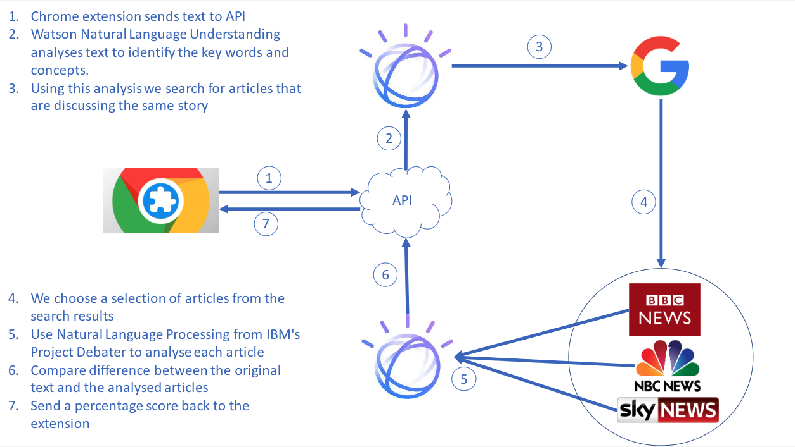

<h1 align="center">Welcome to Hitchhikers 👋</h1>
<p>
  
  <a href="#" target="_blank">
    
  </a>
</p>

> Helping people spot misinformation on the internet, using Watson Natural Language Understanding

## Contents

1. [Short description](#short-description)
1. [Demo video](#demo-video)
1. [The architecture](#the-architecture)
1. [Long description](#long-description)
1. [Project roadmap](#project-roadmap)
1. [Getting started](#getting-started)
1. [Running the tests](#running-the-tests)
1. [Built with](#built-with)
1. [Authors](#authors)
1. [License](#license)
1. [Acknowledgments](#acknowledgments)

## Short description
TODO: Add short description
```markdown
### What's the problem?

Part of the World Health Organization's guidance on limiting further spread of COVID-19 is to practice social distancing. As a result, schools in most affected areas are taking precautionary measures by closing their facilities. With school-aged children at home for an indeterminate amount of time,  keeping them engaged, entertained, and on top of their education is important.

### How can technology help?
TODO: Add idea
Schools and teachers can continue to engage with their students through virtual classrooms, and even create interactive spaces for classes. As parents face a new situation where they may need to homeschool their children, finding appropriate online resources is important as well.

### The idea
It's imperative that learning and creating can continue when educational institutions have to shift the way they teach in times of crises, such as the COVID-19 pandemic. Providing a set of open source tools, backed by IBM Cloud and Watson Services, will enable educators to more easily make content available for their students.
```
## Demo video
TODO: Make and deliver video
[](https://youtu.be/vOgCOoy_Bx0)

## The architecture


TODO: Change this text
```
1. The user navigates to the site and uploads a video file.
2. Watson Speech to Text processes the audio and extracts the text.
3. Watson Translation (optionally) can translate the text to the desired language.
4. The app stores the translated text as a document within Object Storage.
```
## Long description
TODO: Write long description
[More detail is available here](DESCRIPTION.md)

## Project roadmap
TODO: Make roadmap


## Getting started

These instructions will get you a copy of the project up and running on your local machine for development and testing purposes. See deployment for notes on how to deploy the project on a live system.

### Prerequisites

* Google Chrome to run the extension
* Node.js
* An API Key and URL for IBM Watson Natural Language
```sh
# export these into your terminal before you run it
export NATURAL_LANGUAGE_UNDERSTANDING_IAM_APIKEY="";
export NATURAL_LANGUAGE_UNDERSTANDING_URL="";
# See more here: https://www.npmjs.com/package/@ibm-watson/natural-language-understanding-nodejs#prerequisites
```


* An API Key for Microsoft Bing Search API
```sh
# export these into your terminal before you run it
export BING_SEARCH_APIKEY="";
# See more here: https://azure.microsoft.com/en-us/services/cognitive-services/bing-news-search-api/
```

### Install and build

```sh
# From top level directory

# Install dependencies
npm run install:all

# Build client
npm run build:all
```

### Usage


#### Server

```sh
# From top level directory
npm start
```

#### Chrome Extension

```
Visit: chrome://extensions/
Enable: Developer mode
Press: Load Unpacked
Click: extension folder
```

Once the server is running and you've loaded the Chrome Extension, go to your Twitter timeline and watch as the Tweets are analysed.

From there you can easily see the different view points by clicking on the "click here for more information" button that is highlighted.

## Running the server tests
*Note: you need the API keys as described in the prerequisites*

```bash
cd server && npm install && npm run apitest
```

## Built with

* [IBM Watson Natural Language](https://www.ibm.com/uk-en/cloud/watson-natural-language-understanding) - Used to extract the "claim" from a social media post
* [Microsoft Bing Search API](https://azure.microsoft.com/en-us/services/cognitive-services/bing-news-search-api/) - Used to get articles about a topic
* [Express.js](https://expressjs.com/) - Powers the Node.js server
* [React.js](https://reactjs.org/) - Handles the front end (Home and more info pages)

## Authors

* **Craig Forrest** - *Initial work, recently left IBM* - https://github.com/CForrest97
* **Richard Waller** - https://github.com/rwalle61
* **Matt Emerson** - https://github.com/mattemerson1
* **Cameron Roberts** - https://github.com/cameronldroberts
* **James Wallis** - https://github.com/james-wallis

See also the list of [contributors](https://github.com/james-wallis/hitchhikers/graphs/contributors) who participated in this project.

## License

This project is licensed under the Apache 2 License - see the [LICENSE](LICENSE) file for details

## Acknowledgments

* Based on [the Code and Response README template](https://github.com/Code-and-Response/Project-Sample/blob/master/README.md).
